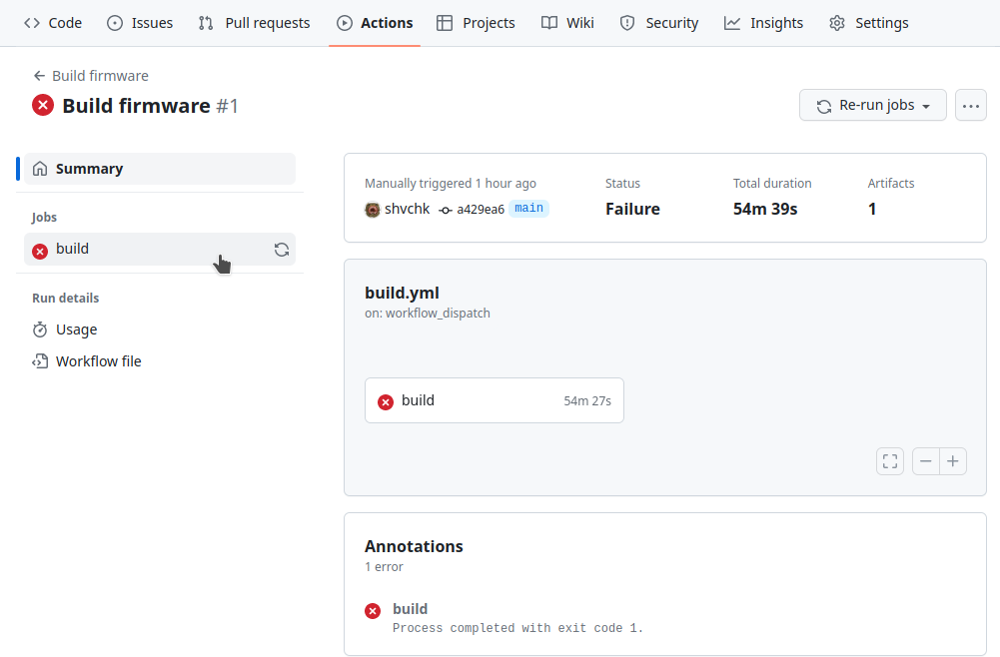
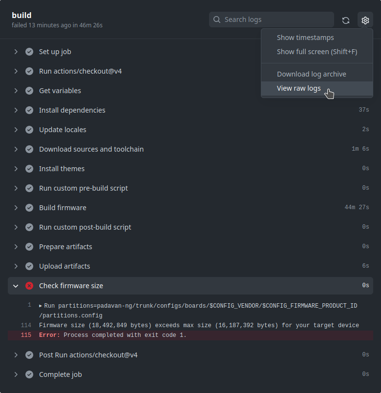

## Automatic Padavan firmware builds using GitHub servers

### Usage

- [Fork this repository](https://github.com/shvchk/padavan-builder-workflow/fork), further steps perform in your fork

- Copy your build config to [build.config](build.config)

  Build config template can be found in the [firmware repository](https://gitlab.com/hadzhioglu/padavan-ng/-/tree/master/trunk/configs/templates)

- Run build process: Actions → Build firmware → Run workflow

  

  Build process will be shown on the same page (if it doesn't show, just refresh page). You can get process details by clicking on it.

  Depending on build config, build process usually takes from 10 to 60 minutes.

- While process is in progress, its status indicator would be gold-ish circle

  

- If the process finishes successfully, its status indicator would turn green with a check mark

  

  Click on the finished process. Archive with the firmware would be stored as its artifact:

  

  Firmware license does not allow binaries distribution, so this archive would be stored for 7 days for personal use.

- If the process finishes with an error, its status indicator would turn red with a cross

  

  Click on the finished process. To get details about the error, click on the failed `build` job at the left:

  

  Job report will open:

  

  Here we can quickly see that it was "Check firmware size" step that failed — it's marked with a red circle with a cross. Specific reason is shown below: Firmware size (18443033) exceeds max size (16187392) — i.e. firmware is too big for target device.

  In case of any error reason is always shown at the end of the log, as in the example above. To view full log click on the cog icon in the top right corner → View raw logs. You can also download compressed log archive with Download log archive.

  If you can't figure out the problen on your own, you can ask community or firmware developer for help. In this case don't forget to attach the log archive.

### Advanced usage

You can set firmware repository, branch, specific tag or commit in [`variables`](variables) file.

You can also create `pre-build.sh` script with any custom commands, which will be executed just before build process. By that time firmware source code is already downloaded, so you can add or change anything in it.

You can also create `post-build.sh` script, which will be executed right after build process.

---

Discussion: https://github.com/shvchk/padavan-builder-workflow/discussions/categories/general
